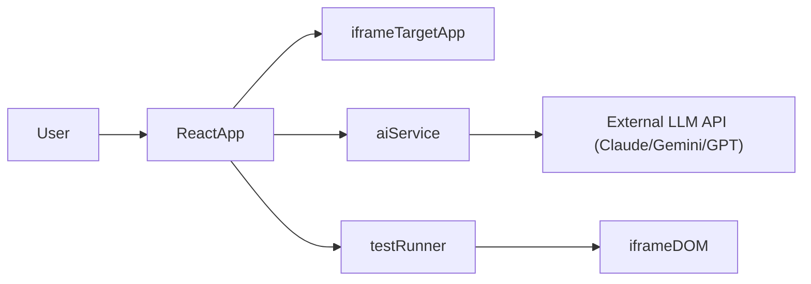

## Mục tiêu & Tính khả thi

- **Mục tiêu**: Web React TS cho phép:
  - Nhập mô tả test bằng tiếng Việt (VD: login, điền form, validate lỗi, đính kèm tài liệu validate).
  - Dùng LLM (Claude/Gemini/GPT, model miễn phí) sinh ra **script test có cấu trúc**.
  - Chạy script đó trực tiếp trên DOM của một `iframe` chứa app cần test (localhost hoặc domain cho phép truy cập DOM).
- **Tính khả thi**:
  - **Truy cập DOM trong iframe**: Chỉ khả thi nếu trang trong iframe cùng origin hoặc được cấu hình cho phép (không bị chặn bởi Same-Origin Policy). Điều này phù hợp với use case test nội bộ (VD: app chạy trên cùng domain/localhost).
  - **Không dùng backend riêng**: Về mặt kỹ thuật, React FE có thể gọi trực tiếp API LLM, nhưng:
    - **Lộ API key** nếu build production. Chấp nhận được cho demo nội bộ, không an toàn để public.
    - Kế hoạch sẽ **tách lớp gọi LLM** thành 1 service, sau này dễ chuyển sang backend nếu cần.
  - **Engine chạy test trong browser**: Ta sẽ tự xây một mini test runner dùng DOM API (click, type, assert text/validation). Không cần Playwright/Cypress ở phía backend.

## Kiến trúc tổng quan

- **ReactApp**: SPA viết bằng React + TypeScript.
- **iframeTargetApp**: App cần test, chạy trên URL mà user cấu hình.
- **aiService**: Module FE trừu tượng hóa việc gọi LLM (sau này có thể chuyển sang backend).
- **testRunner**: Module đọc script test (JSON/DSL) và thao tác DOM bên trong iframe.

## Công cụ & thư viện đề xuất

- **Bundler/Boilerplate**:
  - **Vite + React + TypeScript** (`npm create vite@latest my-auto-test -- --template react-ts`).
- **UI**:
  - **MUI** (`@mui/material`, `@mui/icons-material`) hoặc **Ant Design** để nhanh có layout đẹp.
- **Quản lý state & data**:
  - Bắt đầu với **React hooks** (`useState`, `useReducer`, `useEffect`).
  - Có thể thêm **Zustand** nếu state phức tạp dần.
- **Form & validate input kịch bản**:
  - **react-hook-form** (nhập mô tả, URL, option) + **zod** để validate/parse JSON từ LLM.
- **Code editor hiển thị script test** (tùy chọn, giai đoạn 1 có thể chỉ dùng `<textarea>`):
  - `@monaco-editor/react` hoặc `react-ace` cho trải nghiệm giống IDE.
- **HTTP client**:
  - Native `fetch` là đủ; có thể dùng `axios` nếu bạn quen.
- **Gọi LLM**:
  - Ban đầu chỉ cần module JS trừu tượng, ví dụ `aiService.generateTestScript(prompt): Promise<TestScript>`.
  - Triển khai cụ thể: dùng `fetch` tới endpoint của OpenAI/Gemini/Claude (key để trong `.env` local, không commit).

## Thiết kế data model script test

- **TestScenario** (1 kịch bản):
  - `id`, `name`, `description` (từ prompt người dùng).
  - `steps: TestStep[]`.
- **TestStep** (một hành động/kiểm tra):
  - `type`: `"navigate" | "click" | "type" | "assertText" | "assertVisible" | "assertValidationError" | ...`.
  - `selector`: CSS selector hoặc chiến lược tìm (VD: `[data-testid="username-input"]`).
  - `value?`: text để nhập, hoặc URL.
  - `expected?`: giá trị kỳ vọng (text/lỗi validation).
  - `timeoutMs?`, `delayMs?` cho thao tác async.
- LLM sẽ được hướng dẫn **trả về JSON theo schema này**, FE dùng `zod` để validate trước khi chạy.

## Thiết kế màn hình chính

- **Layout chung** (một trang duy nhất cho MVP):
  - **Header**: Tên tool, chọn model LLM, status (đang gọi AI, đang chạy test).
  - **Main area dạng các khối theo hàng (column)**:
    - **Khối 1 – Ứng dụng cần test**:
      - Input URL target (`TextField`), nút "Load".
      - Vùng `iframe` load URL với tỉ lệ cố định **16:9** (CSS `aspect-ratio: 16 / 9`) tương ứng màn Full HD; nếu app cao hơn thì phần nội dung bên trong có thể scroll.
    - **Khối 2 – Kịch bản test & AI (tabs)**:
      - **Tab "Mô tả kịch bản"**:
        - `Textarea`/editor cho mô tả natural language (VD: login, điền form, validate).
        - Khu vực upload/link tài liệu validate (giai đoạn 1 có thể là textarea thêm ghi chú).
        - Nút **"Generate test"** → gọi `aiService`.
      - **Tab "Script test"**:
        - Hiển thị JSON script sinh ra (Monaco editor read-only hoặc textarea).
        - Cho phép chỉnh tay (optional, có cảnh báo).
      - **Tab "Kết quả chạy"**:
        - Log từng step, trạng thái (PASS/FAIL), message, thời gian.
        - Tổng quan: tổng step, pass/fail.
- **Nút hành động chính**:
  - "Generate test" (tạo script từ LLM).
  - "Run test" (chạy script hiện tại lên iframe).
  - Tuỳ chọn: "Reset" kịch bản.

## Ghi chú UI/UX & theme

- **Theme**: Ứng dụng đang sử dụng **MUI dark theme** (`palette.mode = "dark"`) bọc quanh `App` bằng `ThemeProvider` + `CssBaseline` để toàn bộ text, label, placeholder hiển thị rõ trên nền tối.
- **Placeholder & input text**:
  - Toàn cục: cấu hình màu chữ/placeholder sáng hơn trong `index.css` cho `input`, `textarea` (kế thừa màu text `body`).
  - MUI: override `MuiInputBase` (`&::placeholder`) và `MuiFormLabel` trong `App.tsx` để bảo đảm placeholder, label trong `TextField` không bị tối màu ở dark mode.

## Thiết kế test runner trong browser

- **Mục tiêu**: Nhận `TestScenario` → chạy lần lượt từng `TestStep` trên `iframe`:
  - Lấy `iframeRef.current.contentWindow.document`.
  - Mỗi step:
    - `navigate`: đổi `iframe.src` hoặc viết riêng, thường điều hướng thực hiện qua URL ở ngoài.
    - `click`: dùng `querySelector(selector)` → `element.click()`.
    - `type`: focus input, set `value`, dispatch `input`/`change` events.
    - `assert`*: tìm element, kiểm tra text/visibility/class lỗi, nếu không đúng thì đánh FAIL.
  - Runner là async/await, có delay ngắn giữa các bước để UI kịp update.
- **Xử lý lỗi & log**:
  - Try/catch từng step; nếu lỗi thì log chi tiết (step index, selector, message), đánh FAIL nhưng vẫn cho phép tiếp tục hoặc dừng tùy cấu hình.
  - Trả về `TestResult` chứa log để hiển thị ở tab "Kết quả chạy".
- **Giới hạn kỹ thuật**:
  - Runner chỉ hoạt động nếu script và iframe cùng origin. Nếu không, sẽ bị lỗi `SecurityError`.

## Luồng AI sinh script

1. User nhập mô tả kịch bản (tiếng Việt) + ghi chú validate.
2. FE xây **prompt** chuẩn:
  - Giải thích ngắn về app, các kiểu step hỗ trợ.
  - Yêu cầu trả về **JSON thuần** theo schema đã định, không kèm text khác.
3. Gọi `aiService.generateTestScript(prompt)`:
  - FE gọi tới backend proxy Node/Express (`/api/claude/generate-test`) thay vì gọi trực tiếp LLM để tránh CORS và ẩn API key.
  - Mặc định backend đang dùng **chế độ JSON steps** (mode = `json-steps`) để sinh ra cấu trúc `TestScenario` như hiện tại.
  - Backend đã hỗ trợ thêm **chế độ sinh code Cypress-like** (mode = `cypress`) cho cùng endpoint:
    - Khi body có `mode: "cypress"`, system prompt yêu cầu Claude trả về **duy nhất code JavaScript phong cách Cypress** (sử dụng đối tượng `cy` được inject ở browser).
    - Code này được design để có thể thực thi ngay trong trình duyệt bằng cách truyền `cy` trỏ vào DOM của iframe (phần runner FE sẽ được bổ sung sau).
    - Response từ Claude vẫn theo schema Messages API gốc (mảng `content[...]` chứa `text` là nội dung code).
  - Ở MVP hiện tại, FE mới chỉ dùng mode JSON, phần chạy code Cypress trong browser là bước mở rộng tiếp theo.
4. Nếu JSON hợp lệ, lưu vào state `currentScenario` và hiển thị ở tab "Script test".
5. User bấm "Run test" để chạy với `testRunner`.

## Các bước triển khai (high level)

1. **Khởi tạo project React TS bằng Vite**, cấu hình cơ bản (alias, ESLint, Prettier nếu cần).
2. **Cài đặt thư viện UI và core** (`@mui/material`, `react-hook-form`, `zod`, optionally `@monaco-editor/react`).
3. **Tạo layout màn hình chính** với 2 cột (iframe + side panel), chưa cần AI.
4. **Định nghĩa type & schema cho TestScenario/TestStep** và implement `testRunner` chạy trên iframe với một script demo hard-code.
5. **Xây `aiService` (FE)** với interface rõ ràng, tạm thời mock dữ liệu, sau đó nối thật tới API LLM theo key `.env` local.
6. **Kết nối flow đầy đủ**: nhập mô tả → generate script (AI/mock) → xem/tuỳ chỉnh → run → xem log.
7. **Tinh chỉnh UI/UX**: loading state, error state, highlight step đang chạy, v.v.

Kế hoạch trên tập trung vào FE-only, dùng LLM qua API ở client (demo/internal). Nếu sau này bạn muốn production an toàn, ta sẽ thêm một backend mỏng làm proxy cho LLM và không đổi kiến trúc FE nhiều.